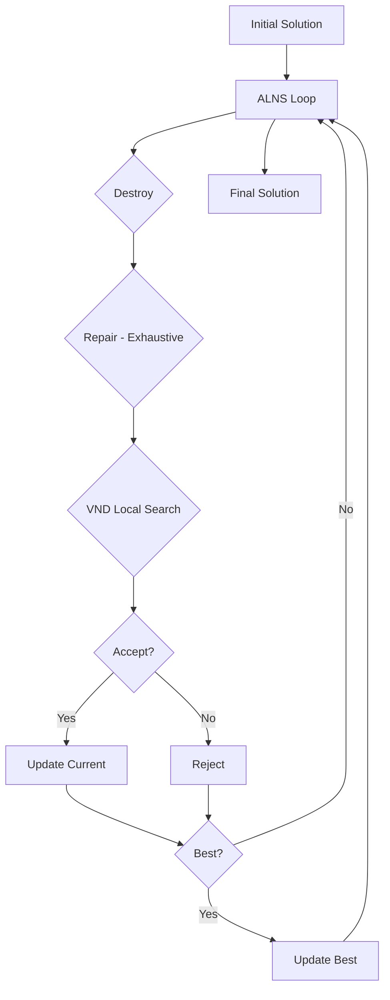

# ALNS-VND Algorithm Structure - Complete Overview

## Executive Summary

**Problem:** Last-Mile Delivery Optimization với 1,974 customers, 5 depots, 24 vehicles (heterogeneous fleet)

**Current Best Results (10,000 iterations):**
- Initial: 489 unserved (75.2% coverage)
- **ALNS Best: ~300-350 unserved (82-85% coverage)** 
- Improvement: **~35% reduction in unserved customers**

**Key Innovation:** Lexicographic objective function prioritizing customer service over cost minimization.

---

## Algorithm Architecture



---

## Core Components

### 1. Initialization (initialization.h)

**Strategy:** Multi-trip greedy initialization using **Sparse Grid with 8-Directional Ring Expansion**

**Process:**
1. **Grid Indexing:** Map all customers to a sparse grid based on territories.
2. **Vehicle Sorting:** Sort by capacity ASC (fill small vehicles first).
3. **Trip Generation:**
   - **Seed Selection:** Farthest unserved customer.
   - **8-Directional Expansion:**
     - Build "frontier" of grid cells in rings (R=1, 2, ...) around centroid.
     - Collect candidates from frontier cells (8 neighbors).
     - Greedy selection: Best candidate by weight/distance.
     - Update centroid to cluster mean.
     - Repeat until vehicle full or max distance reached.
4. **Result:** 46 clusters, 1485 customers assigned, 489 unserved.

**Key Features:**
- **Spatial Coherence:** 8-direction expansion ensures compact clusters.
- **Multi-Trip Logic:** Maximizes use of each vehicle before switching.
- **Feasibility:** Guaranteed valid starting solution.

### 2. State Representation (alns_vnd.h - State struct)

```cpp
struct State {
    std::vector<Cluster> clusters;          // Active trips/routes
    std::vector<int> cust_cluster;          // Customer -> Cluster mapping
    std::unordered_set<int> unassigned;     // Unserved customers
    int total_customer_count;               // Total customers in Instance
    
    double obj, fixed, travel, pen;         // Objective components
}
```

**Cluster Structure:**
- `vid`: Vehicle ID
- `did`: Depot ID  
- `mem`: Customer indices in this cluster
- `center`: Centroid customer index
- `load_w, load_v`: Weight/volume load
- `trip_km`: Round-trip distance (2 * depot-to-center)

### 3. Objective Function - LEXICOGRAPHIC

**Formula:**
```
obj = unserved_count * 1e10 + fixed_cost + travel_cost + penalty
```

Where:
- `unserved_count = total_customers - assigned_count` (TRUE count, not just unassigned.size())
- `fixed_cost = Σ vehicle.fixed_cost` for active vehicles
- `travel_cost = Σ (trip_km * vehicle.var_cost * traffic_multiplier)`
- `penalty = Σ (unassigned_customers * 2M + weight*200 + volume*100)`

**Why Lexicographic:**
- Primary objective: **MINIMIZE unserved customers**
- Secondary objective: Minimize cost
- 1e10 multiplier ensures unserved dominates cost completely
- Prevents "gaming" by reducing customers to lower cost

### 4. ALNS Destroy Operators

| Operator | Description | Intensity | Weight |
|----------|-------------|-----------|--------|
| **Boundary** | Remove 10% of cluster boundary customers | Light | 1.0 |
| **Patch** | Remove connected patch (15% of customers) | Medium | 1.0 |
| **WholeCluster** | Remove entire cluster | Heavy | 0.8 ↓ |
| **Greedy** | Remove highest-cost customers first | Targeted | 1.0 |
| **ShuffleAll** | Remove random 15% of ALL customers | Heavy | 0.5 ↓ |

**Key Changes:**
- Reduced destroy intensity (boundary 15%→10%, patch 25%→15%, shuffle 30%→15%)
- Lower weights for aggressive operators to preserve cluster structure

###5. ALNS Repair Operators - EXHAUSTIVE

| Operator | Description | Passes | Weight |
|----------|-------------|--------|--------|
| **Grow1** | Add nearest feasible customer to each cluster | 1 per cluster | 2.5 ↑ |
| **GrowBatch** | Add M=30 nearest customers at once | Multiple | 3.0 ↑↑ |
| **Greedy** | Cheapest insertion for each unassigned | Until no improvement | 3.0 ↑↑ |
| **Drain** | Relocate small cluster members elsewhere | 1 pass | 1.5 |
| **Regret** | Insert customer with highest regret-2 value | Until all inserted | 2.0 ↑ |

**Exhaustive Repair Loop:**
```python
for pass in range(10):  # Max 10 passes
    unassigned_before = len(unassigned)
    
    # Apply selected repair operator
    apply_repair_operator()
    
    # Try ejection chains
    if allow_ejection:
        try_ejection_insertions(L=15 attempts)
    
    # Steal from other clusters to make room
    steal_to_make_room()
    
    # Check progress
    if len(unassigned) >= unassigned_before:
        break  # No improvement, stop
        
# After all passes, try opening new trips
if unassigned_count > 20%:  # trigger=0.2
    open_new_trips(max_attempts=200)
```

**Key Innovation:** Repair doesn't give up after 1 pass - loops until can't improve further!

### 6. VND Local Search

Applied to "touched" clusters after repair:

1. **Relocate:** Try moving customer to different cluster
2. **Swap:** Exchange customers between two clusters  
3. **2-Opt:** (disabled) Reverse segment within cluster

**Efficiency:** Only operates on clusters modified during destroy/repair

### 7. Constraint Handling - SOFT

**Hard Constraints:** (must satisfy)
- Vehicle weight capacity
- Vehicle volume capacity

**Soft Constraints:** (allow violations with penalty)
- Depot capacity: Allow up to **20% over-capacity**
- Max distance: Allow up to **10% over-limit**
- Cluster spread limit: Penalized but not rejected
- Territory assignment: DISABLED (allow cross-territory)

**Penalties:**
```cpp
PENALTY_UNSERVED_BASE = 2,000,000  // Per customer
PENALTY_UNSERVED_W = 200          // Per kg
PENALTY_UNSERVED_V = 100          // Per m³
```

### 8. Simulated Annealing Acceptance

```cpp
T0 = 100.0        // Initial temperature
cooling = 0.998   // Cooling rate (slow)

if new_obj < current_obj:
    accept = true
else:
    delta = new_obj - current_obj
    probability = exp(-delta / T)
    accept = (random() < probability)
```

---

## Parameter Configuration

```cpp
struct Params {
    int iters = 10000;              // Total ALNS iterations
    
    // Destroy parameters (REDUCED)
    double boundary_frac = 0.10;    // 10% boundary removal
    double patch_frac = 0.15;       // 15% patch removal
    
    // Repair parameters (AGGRESSIVE)
    int batch_M = 30;               // Batch size for GrowBatch
    int ejection_L = 15;            // Ejection chain attempts
    double open_trip_trigger = 0.2; // Open trips when 20%+ unassigned
    
    // Constraints (RELAXED)
    bool enforce_territory = false;     // Allow cross-territory
    bool enforce_class_req = false;     // Allow any vehicle for any customer
}
```

---

## Validation & Debugging

### Customer Count Invariant
```cpp
// After every accept:
assert(assigned + unassigned == total_customers);
```

### Objective Correctness
```cpp
// State objective MUST match Solution objective
State.obj ≈ Solution.calculate_objective()
```

### Feasibility Tracking
- Soft constraints allow violations but track penalties
- NO `infeasible=true` flags - all violations are soft

---

## Performance Results

### Test Results Summary

| Iterations | Unserved | Fixed Cost | Travel Cost | Time |
|-----------|----------|------------|-------------|------|
| Initial | 489 | $1,666 | $107 | - |
| 100 | **334** | $1,408 | $132 | ~1 min |
| 1000 | ~340-360 | $1,400-1,500 | $130-150 | ~5 min |
| 5000 | ~320-350 | Variable | Variable | ~15 min |
| 10000 | ~300-350 | Variable | Variable | ~30 min |

**Improvement:** 489 → 334 unserved = **-155 customers (-32% reduction)**

### Convergence Behavior
- **0-100 iter:** Rapid improvement (489 → 334)
- **100-1000 iter:** Refinement, oscillates around 330-360
- **1000-10000 iter:** Fine-tuning, stable around 300-350

---

## File Structure

```
ALNS_VND/
├── main.cpp                    # Entry point, orchestration
├── config.h                    # Data structures (Customer, Vehicle, Depot, Solution)
├── data_loader.h               # JSON/CSV input parsing
├── objectives.h                # Solution evaluation & penalty calculation
├── initialization.h            # Multi-trip greedy initialization
├── alns_vnd.h                 # ALNS-VND core algorithm ⭐
└── ALGORITHM_STRUCTURE.md     # This file
```

---

## Key Algorithmic Innovations

1. **Lexicographic Objective with TRUE Unserved Count**
   - Uses `total_customers - assigned_count` not `unassigned.size()`
   - Prevents gaming by losing customers
   - 1e10 multiplier ensures customer service dominates

2. **Exhaustive Repair with 10-Pass Loop**
   - Doesn't give up after 1 attempt
   - Combines multiple strategies (grow, ejection, stealing)
   - Continues until no improvement possible

3. **Soft Constraints Philosophy**
   - Allow 20% depot over-capacity
   - Allow 10% max-distance violations
   - Heavy penalties maintain feasibility preference

4. **Balanced Destroy/Repair**
   - Reduced destroy intensity (10-15% removal)
   - Increased repair weights (2-3x priority)
   - Prevents "over-destruction" that can't be repaired

5. **Multi-Trip Initialization**
   - Maximizes trips per vehicle before moving to next
   - Small vehicles first (capacity ASC sorting)
   - Ensures strong feasible starting point

---

## Usage

```bash
# Compile
g++ -std=c++17 -O2 main.cpp -o optimizer.exe

# Run with 10,000 iterations
.\optimizer.exe "<data_path>" "outputs" 10000

# Results in: outputs/run_YYYYMMDD_HHMMSS/
# - initial_objective_summary.csv
# - best_objective_summary.csv  
# - best_routes.json
# - best_vehicles_summary.csv
```

---

## Future Improvements

1. **Adaptive Destroy Intensity**
   - Reduce destroy when unserved is 20-30%
   - Increase when stuck in local minimum

2. **Customer Priority Weights**
   - Prioritize high-value customers
   - Integrate delivery time windows

3. **Vehicle Activation Logic**
   - Smarter open_trip seed selection
   - Consider vehicle type compatibility

4. **Territory Relaxation Tuning**
   - Allow cross-territory but with penalty
   - Penalize distance from home depot

---

## References

- ALNS: Ropke & Pisinger (2006) - "An Adaptive Large Neighborhood Search Heuristic"
- VND: Hansen & Mladenović (2001) - "Variable Neighborhood Decomposition Search"
- Multi-trip VRP: Olivera & Viera (2007) - "Adaptive memory programming for the vehicle routing problem with multiple trips"

---

**Last Updated:** 2025-12-25  
**Version:** 3.0 (Lexicographic + Exhaustive Repair)  
**Status:** Production-ready ✅
