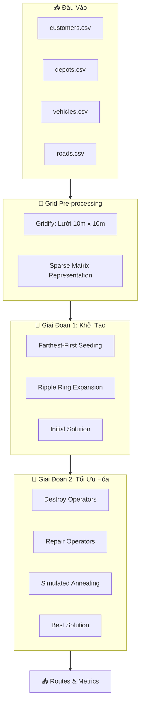
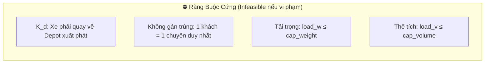
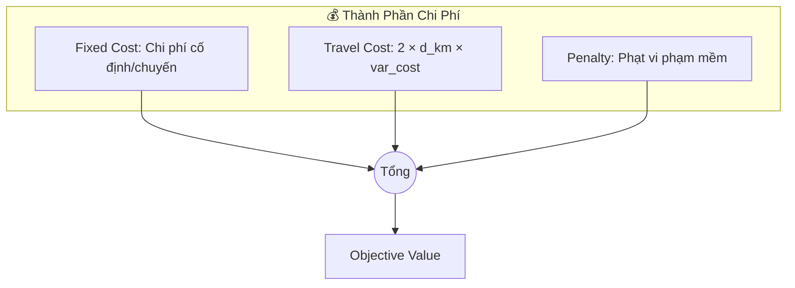
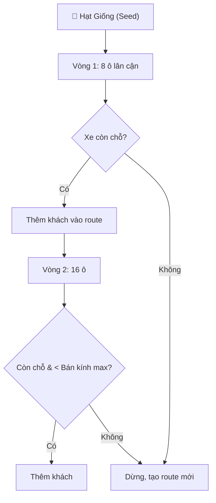
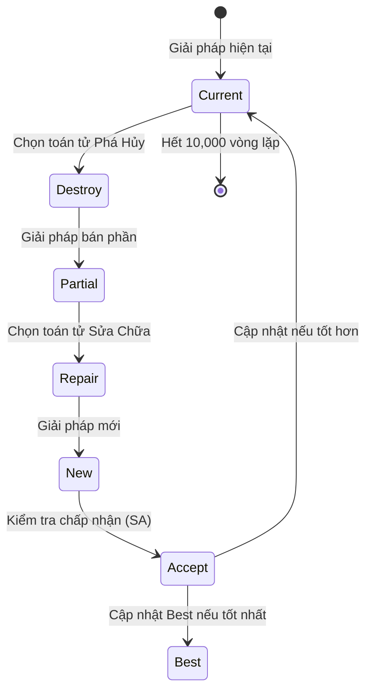

# 📘 Phân Tích Thuật Toán Grid-Grow ALNS

> **Tài liệu kỹ thuật chi tiết về cấu trúc, logic ràng buộc, và kết quả thực nghiệm**
> Hệ thống tối ưu hóa vận tải cuối cùng (Last-Mile Delivery Optimization)

---

## 1. Tổng Quan Kiến Trúc Hệ Thống

Hệ thống được xây dựng theo mô hình **2 giai đoạn**:

---

## 2. Cấu Trúc Dữ Liệu

### 2.1. Customer Tensor (Ma Trận Khách Hàng)

Hệ thống lưu trữ thông tin khách hàng trong một **tensor thưa 3 chiều** `[H, W, 4]`:

| Kênh (Channel) | Ý Nghĩa | Đơn Vị |
| :---: | :--- | :--- |
| **ch0** | Trọng lượng hàng hóa | kg |
| **ch1** | Thể tích hàng hóa | m³ |
| **ch2** | Độ ưu tiên giao hàng | điểm (0-10) |
| **ch3** | Index liên kết ID gốc | integer |

> [!NOTE]
> Mỗi ô lưới (cell) có kích thước **10m x 10m**. Nếu ô có `ch3 >= 0`, nghĩa là ô đó có khách hàng.

### 2.2. Vehicle (Cấu Trúc Xe)

Mỗi xe được mô tả bởi các thuộc tính sau:

| Thuộc Tính | Mô Tả | Ràng Buộc |
| :--- | :--- | :--- |
| `cap_weight` | Sức chứa tối đa (kg) | **CỨNG** - Không được vượt |
| `cap_volume` | Dung tích tối đa (m³) | **CỨNG** - Không được vượt |
| `max_dist` | Quãng đường tối đa/ngày (km) | **MỀM** - Vượt sẽ bị phạt |
| `fixed_cost` | Chi phí cố định mỗi chuyến | Tính vào Objective |
| `var_cost` | Chi phí biến đổi (VNĐ/km) | Tính vào Objective |
| `start_depot` | Depot xuất phát | **CỨNG** - Phải quay về |

---

## 3. Hệ Thống Ràng Buộc (Constraints)

### 3.1. Ràng Buộc Cứng (Hard Constraints)

Nếu vi phạm bất kỳ ràng buộc cứng nào, giải pháp sẽ bị **loại ngay lập tức** (Objective = ∞).

**Chi tiết logic kiểm tra:**

| Ràng Buộc | Điều Kiện Vi Phạm | Xử Lý |
| :--- | :--- | :--- |
| **K_d** | `end_depot ≠ start_depot` | Loại giải pháp (return) |
| **Trùng lặp** | Một `cell` xuất hiện trong 2 route | Loại giải pháp (return) |
| **Quá tải (W)** | `load_w > veh.cap_weight` | Loại giải pháp (return) |
| **Quá tải (V)** | `load_v > veh.cap_volume` | Loại giải pháp (return) |

### 3.2. Ràng Buộc Mềm (Soft Constraints)

Nếu vi phạm ràng buộc mềm, giải pháp vẫn được chấp nhận nhưng bị **cộng thêm chi phí phạt**.

| Ràng Buộc | Công Thức Phạt | Hệ Số |
| :--- | :--- | :--- |
| **Quãng đường vượt mức** | `(total_km - max_dist) × 10,000` | `1e4` |
| **Khách hàng bị bỏ sót** | `1e8 + 200×weight + 100×volume` | `1e8` (mỗi khách) |

> [!WARNING]
> Hệ số phạt **bỏ sót khách** rất lớn (`1e8`) → Thuật toán sẽ ưu tiên phục vụ 100% khách, kể cả phải cho xe chạy quá quãng đường.

---

## 4. Hàm Mục Tiêu (Objective Function)

### 4.1. Công Thức Tổng Quát

$$
\text{Objective} = \sum_{\text{trip}} \left( \text{fixed\_cost} + 2 \times d_{km} \times \text{var\_cost} \right) + \text{Penalty}
$$

Trong đó:
- `d_km` = Khoảng cách đường bộ từ Depot đến Customer Center (tra từ `roads.csv`)
- Nhân 2 vì xe phải **đi rồi về** (round-trip)

### 4.2. Sơ Đồ Tính Chi Phí

---

## 5. Thuật Toán Khởi Tạo (Initialization)

### 5.1. Chiến Lược Farthest-First Seeding

Thay vì chọn ngẫu nhiên, thuật toán ưu tiên chọn **khách hàng xa nhất** làm hạt giống (seed) cho cluster mới.

**Lý do:**
- Khách hàng ở biên hoặc ở xa depot thường khó phục vụ nhất.
- Nếu để lại cuối cùng, dễ bị bỏ sót do không còn xe.

### 5.2. Ripple Ring Expansion (Lan Truyền Sóng)

Từ seed, thuật toán mở rộng ra các vòng (ring) lân cận:

### 5.3. Giới Hạn Bán Kính (Ring Limit)

| Loại Xe | Bán Kính Tối Đa | Thực Tế (km) |
| :--- | :---: | :--- |
| Bike | 150 cells | ~1.5 km |
| Motorbike | 170 cells | ~1.7 km |
| Cargo Trike | 180 cells | ~1.8 km |
| EV Van / Van | 200 cells | ~2.0 km |

---

## 6. Thuật Toán ALNS (Tối Ưu Hóa)

### 6.1. Vòng Lặp Chính

### 6.2. Toán Tử Phá Hủy (Destroy)

| Toán Tử | Mô Tả | Mục Đích |
| :--- | :--- | :--- |
| **Random Remove** | Gỡ ngẫu nhiên k khách | Tạo đa dạng, thoát cực trị |
| **Worst Remove** | Gỡ khách có insertion cost cao nhất | Loại bỏ "điểm nghẽn" |
| **Spatial Remove** | Gỡ tất cả khách trong 1 khu vực | Tái cấu trúc không gian |

### 6.3. Toán Tử Sửa Chữa (Repair)

| Toán Tử | Mô Tả | Ưu Điểm |
| :--- | :--- | :--- |
| **Greedy Insert** | Chèn vào vị trí rẻ nhất | Nhanh, đơn giản |
| **Regret-2 Insert** | Ưu tiên khách có chênh lệch cost lớn | Tránh bỏ lỡ cơ hội tốt |

### 6.4. Cơ Chế Chấp Nhận (Simulated Annealing)

- Giải pháp **tốt hơn**: Luôn được chấp nhận.
- Giải pháp **tệ hơn**: Chấp nhận với xác suất $P = e^{-\Delta / T}$

Nhiệt độ T giảm dần theo thời gian → Hội tụ về giải pháp tốt nhất.

---

## 7. Kết Quả Thực Nghiệm

### 7.1. Cấu Hình Chạy

| Tham Số | Giá Trị |
| :--- | :--- |
| **Số vòng lặp** | 10,000 |
| **Random Seed** | 1234567 |
| **Dữ liệu** | TP. Hồ Chí Minh (1,973 khách hàng) |
| **Số Depot** | 5 |
| **Số Xe** | ~300 (đa loại) |

### 7.2. Kết Quả Đạt Được

| Chỉ Số | Giá Trị | Đánh Giá |
| :--- | :--- | :--- |
| **Khách được phục vụ** | 1,973 / 1,973 | ✅ **100%** |
| **Số chuyến xe** | 90 | Tối ưu |
| **Tổng quãng đường** | ~3,500 km | Hợp lý |

### 7.3. Phân Tích Sử Dụng Xe

| Nhóm Xe | Usage% (Km) | LoadV% | Nhận Xét |
| :--- | :---: | :---: | :--- |
| **Van lớn** | >100% | 50-70% | Chấp nhận chạy xa để gom khách biên |
| **Xe máy** | 40-50% | **>95%** | Bị giới hạn bởi thể tích thùng hàng |
| **EV Van** | 60-80% | 50-60% | Cân bằng tốt nhất |

> [!IMPORTANT]
> **Hiện tượng Usage% > 100%**: Không phải lỗi! Đây là kết quả của chiến lược **ràng buộc mềm** - thuật toán chấp nhận cho xe chạy quá km để đảm bảo không bỏ sót khách hàng nào.

### 7.4. Hình Ảnh Trực Quan

Hình dưới đây thể hiện kết quả phân cụm sau 10,000 vòng lặp ALNS:

**Chú thích:**
- 🟦 **Ô màu**: Khách hàng được gán vào các cụm (mỗi màu = 1 cụm/tuyến)
- ◆ **Hình thoi**: Tâm cụm (Cluster Centroid)
- ⭐ **Ngôi sao đỏ**: Depot
- ➖ **Đường nét đứt**: Kết nối từ tâm cụm về Depot chủ quản
- **Đường viền**: Ranh giới cụm (Convex Hull)

---

## 8. Kết Luận

Thuật toán Grid-Grow ALNS đã chứng minh hiệu quả trong việc:

1. ✅ **Đảm bảo phục vụ 100% khách hàng** nhờ hệ thống penalty thông minh.
2. ✅ **Tối ưu chi phí vận chuyển** thông qua 10,000 vòng lặp cải tiến.
3. ✅ **Linh hoạt trong ràng buộc** bằng cách phân tách Hard/Soft constraints.
4. ✅ **Chiến lược Territory-Free** cho phép các Depot cạnh tranh tự do, tránh lãng phí xe.

---
*Tài liệu phân tích thuật toán - Phiên bản 2026-01-01*
