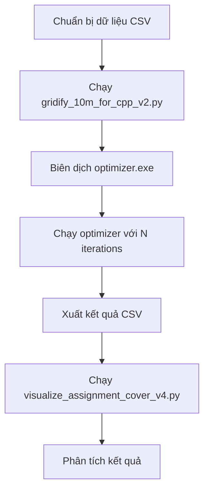

# Grid-Grow ALNS Optimizer - Hướng Dẫn Sử Dụng

Tài liệu hướng dẫn toàn diện cho hệ thống tối ưu hóa phân phối cuối cùng (Last-Mile Delivery Optimization) sử dụng thuật toán **Grid-Grow ALNS** (Adaptive Large Neighborhood Search).

---

## 📁 Cấu Trúc Thư Mục

```
Cpp_optimizer/
├── _cai_nay_chac_an_nay/           # Thư mục chính chứa optimizer
│   ├── optimizer_main.cpp          # Entry point chương trình
│   ├── optimizer.exe               # Executable đã biên dịch
│   ├── config.h                    # Cấu hình & data structures
│   ├── data_loader.h               # Load dữ liệu từ CSV
│   ├── initialization.h            # Khởi tạo giải pháp ban đầu
│   ├── grid_grow_alns.h            # Core ALNS optimizer
│   ├── objectives.h                # Hàm mục tiêu & penalty
│   ├── results_export.h            # Xuất kết quả CSV
│   ├── test_init.cpp               # Test khởi tạo riêng biệt
│   └── visualize_init_v2.py        # Visualize kết quả init
│
├── end_to_end/grid_out/            # Dữ liệu grid đã xử lý
│   ├── customers_sparse_grid.csv   # Tọa độ khách hàng (grid)
│   ├── depots_grid_min.csv         # Tọa độ depot (grid)
│   └── grid_meta.txt               # Metadata (width, height)
│
├── processed_visualize/
│   └── visualize_assignment_cover_v4.py  # Script visualization chính
│
└── Zzz_data/LMDO processed/Ho_Chi_Minh_City/
    ├── vehicles.csv                # Dữ liệu xe
    └── roads.csv                   # Ma trận khoảng cách
```

---

## 🔧 Biên Dịch

### Yêu cầu
- **Compiler**: g++ với C++17 support
- **OS**: Windows (đã test), Linux/Mac (tương thích)

### Lệnh biên dịch

```bash
cd Cpp_optimizer/_cai_nay_chac_an_nay

# Biên dịch optimizer chính
g++ -O3 -std=c++17 optimizer_main.cpp -o optimizer.exe

# Biên dịch test init (optional)
g++ -O3 -std=c++17 test_init.cpp -o test_init.exe
```

---

## 🚀 Chạy Optimizer

### Cú pháp

```bash
./optimizer.exe <grid_dir> <source_dir> <out_dir> <seed> <iterations>
```

### Tham số

| Tham số | Mô tả | Mặc định |
|---------|-------|----------|
| `grid_dir` | Thư mục chứa dữ liệu grid (customers, depots) | `grid_out` |
| `source_dir` | Thư mục chứa vehicles.csv, roads.csv | = grid_dir |
| `out_dir` | Thư mục xuất kết quả | = grid_dir |
| `seed` | Random seed | Thời gian hiện tại |
| `iterations` | Số vòng lặp ALNS | 1000 |

### Ví dụ chạy

```bash
# Chạy 1000 vòng lặp
./optimizer.exe "../end_to_end/grid_out" "D:/path/to/LMDO/Ho_Chi_Minh_City" out 1234567 1000

# Chạy 10,000 vòng lặp (tối ưu sâu hơn)
./optimizer.exe "../end_to_end/grid_out" "D:/path/to/LMDO/Ho_Chi_Minh_City" out 1234567 10000
```

### Output

Kết quả được lưu trong thư mục `out/run_YYYYMMDD_HHMMSS/`:

| File | Mô tả |
|------|-------|
| `alns_assignment.csv` | Gán khách hàng → cụm/xe/depot |
| `alns_routes.csv` | Chi tiết từng trip (km, load, %) |
| `alns_summary.csv` | Thống kê tổng hợp |

---

## 📊 Visualization

### Script chính: `visualize_assignment_cover_v4.py`

```bash
cd Cpp_optimizer/processed_visualize

python visualize_assignment_cover_v4.py \
    --grid_out "../_cai_nay_chac_an_nay/out/run_YYYYMMDD_HHMMSS" \
    --data_dir "../end_to_end/grid_out" \
    --out_png viz_result.png
```

### Tham số

| Tham số | Mô tả | Mặc định |
|---------|-------|----------|
| `--grid_out` | Thư mục chứa kết quả (routes, summary) | **Bắt buộc** |
| `--data_dir` | Thư mục chứa dữ liệu tĩnh (customers, depots) | = grid_out |
| `--routes` | Tên file routes | `alns_routes.csv` |
| `--summary` | Tên file summary | `alns_summary.csv` |
| `--out_png` | Tên file ảnh output | `viz_clusters_v4.png` |
| `--s` | Kích thước marker customer | 8.0 |
| `--show_hull` | Vẽ convex hull | True |
| `--no_cover` | Tắt đường bao chi tiết | False |
| `--show_links` | Vẽ đường nối center-depot | True |

### Các thành phần trong hình

- **Ô vuông màu**: Khách hàng (mỗi cụm 1 màu)
- **Hình thoi (◆)**: Tâm cụm (cluster center)
- **Sao đỏ (★)**: Depot
- **Đường nét đứt**: Nối tâm cụm với depot xuất phát
- **Đường bao**: Ranh giới cụm (filled + outline)

---

## 📈 Các Chỉ Số Quan Trọng

### Trong log output

```
VEHICLE UTILIZATION REPORT (Optimized, R+50)
--------------------------------------------------------------
VehicleID | Type            | TripKM    | MaxKM     | Usage%  | LoadW%  | LoadV%
----------|-----------------|-----------|-----------|---------|---------|-------
V0004     | Van             | 195.90    | 196.00    | 99.9%   | 55.9%   | 81.7%
```

| Chỉ số | Ý nghĩa |
|--------|---------|
| `TripKM` | Tổng quãng đường xe chạy |
| `MaxKM` | Giới hạn km tối đa của xe |
| `Usage%` | % sử dụng quãng đường |
| `LoadW%` | % sử dụng tải trọng |
| `LoadV%` | % sử dụng thể tích |

### Trong `alns_routes.csv`

Các cột mới: `load_w_pct`, `load_v_pct` - phần trăm load mỗi trip.

---

## ⚙️ Điều Chỉnh Tham Số

### Ring Limit (Bán kính khởi tạo)

File: `initialization.h`, function `spread_ring_limit()`

```cpp
switch (t) {
    case VehicleType::BIKE:        return 150;  // cells (10m/cell = 1.5km)
    case VehicleType::MOTORBIKE:   return 170;
    case VehicleType::CARGO_TRIKE: return 180;
    case VehicleType::EV_VAN:      return 200;
    case VehicleType::VAN:         return 200;
}
```

- **Tăng giá trị** → Cụm lớn hơn, phủ xa hơn
- **Giảm giá trị** → Cụm nhỏ gọn hơn

### ALNS Params

File: `grid_grow_alns.h`, struct `ALNSParams`

```cpp
struct ALNSParams {
    int iterations = 1000;          // Số vòng lặp
    double destroy_pct_min = 0.1;   // % phá hủy tối thiểu
    double destroy_pct_max = 0.4;   // % phá hủy tối đa
    double temp_init = 100.0;       // Nhiệt độ SA ban đầu
    double temp_cool = 0.9995;      // Hệ số làm nguội
};
```

---

## 🔄 Workflow Hoàn Chỉnh



1. **Chuẩn bị dữ liệu**: customers.csv, depots.csv, vehicles.csv, roads.csv
2. **Gridify**: Chuyển tọa độ lat/lon → grid 10m
3. **Biên dịch**: g++ -O3 optimizer_main.cpp
4. **Chạy**: ./optimizer.exe với tham số phù hợp
5. **Visualize**: Python script tạo hình ảnh
6. **Phân tích**: Xem log, CSV, hình ảnh

---

## 🐛 Troubleshooting

### Lỗi "0 customers served"
- **Nguyên nhân**: Sai đường dẫn `source_dir` (vehicles.csv, roads.csv)
- **Giải pháp**: Kiểm tra đường dẫn tuyệt đối đến thư mục chứa vehicles.csv

### Lỗi visualization trống
- **Nguyên nhân**: `--data_dir` không đúng
- **Giải pháp**: Chỉ định đường dẫn chính xác đến `end_to_end/grid_out`

### Objective value quá cao
- **Nguyên nhân**: Penalty do vi phạm ràng buộc
- **Giải pháp**: Tăng ring limit hoặc số vòng lặp

---

## 📝 Ghi Chú

- **Territory-Free**: Hệ thống sử dụng chiến lược không phân vùng cứng, cho phép xe từ các depot khác nhau cạnh tranh tự nhiên.
- **Farthest-First Seeding**: Khởi tạo ưu tiên khách hàng xa nhất để đảm bảo phủ sóng toàn diện.
- **Soft Constraints**: Các ràng buộc về km, tải trọng, thể tích được xử lý qua penalty thay vì loại bỏ cứng.

---

*Cập nhật: 2026-01-01*
